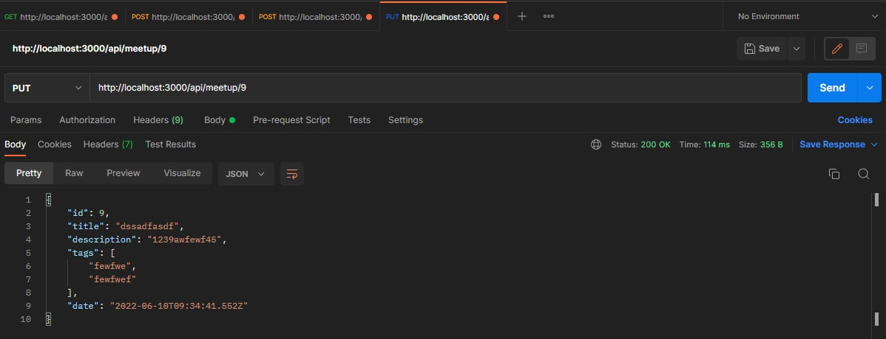

# Meetup-api


## Description
CRUD REST Web API для работы с митапами

## Technologies
Used technologies:

- NodeJS
- ExpressJs
- PostgreSQL

## Sturtup instructions
To run the application, you need open console in project root directory and enter this commands:

DEV: ```npm run dev``` \
\
RELISE: ```npm run start```

## Requests

To send requests you need login or registration system.

To do this, you need go to this endpoints

- http://localhost:3000/api/login
- http://localhost:3000/api/registration

To login send json with two fields "email" and "password". If you sent more fields or invalid json you get json with field "message" that contain error. If all been successes you get json with field "token" that contain jwt token of user.

To registrate send json with fields "name", "surname", "email", "password", "telephone" If you sent more or less fields or invalid json you get json with field "message" that contain error. If all been successes you get json with field "token" that contain jwt token of user.

Server have validator to json data if something wrong you get message with reason. 

### Example

- Login

    - success login 
    
    - invalid login
    
- Registration

    - success registration
    


    - invalid json data
    

    - user already exist
    


- Other errors

    - if you try to do request without login or registration
    


### GET:

To send GET request you need use this endpoints\

- http://localhost:3000/api/meetup
- http://localhost:3000/api/meetup/{id}

### Example:

- get meetups 

    - all
    

    - by id
    

### Post

To send POST request you need use this endpoints and admin access

- http://localhost:3000/api/post

- Post meetup

    - success
    


### PUT

To send POST request you need use this endpoints and admin access

- http://localhost:3000/api/put/{id}

- Put meetup

    - success
    


### Other information

If you need change enviromets variables, you can do it in .env file


&copy; created by Klrushka