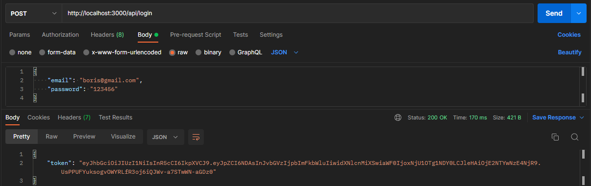

# Meetup-api


## Description
CRUD REST Web API для работы с митапами

## Technologies
Used technologies:

- NodeJS
- ExpressJs
- PostgreSQL

## Startup instructions
To run the application, you need open console in project root directory and enter this commands:

Init project: ```npm install ```

Dev: ```npm run dev``` \
\
Release: ```npm run start```

## Requests

To send requests you need login or registration system.

To do this, you need go to this endpoints

- http://localhost:3000/api/login
- http://localhost:3000/api/registration

To login send json with two fields "email" and "password". If you sent more fields or invalid json you get json with field "message" that contain error. If all been successes you get json with field "token" that contain jwt token of user.

To registrate send json with fields "name", "surname", "email", "password", "telephone" If you sent more or less fields or invalid json you get json with field "message" that contain error. If all been successes you get json with field "token" that contain jwt token of user.

Server have validator to json data if something wrong you get message with reason. 

To configure application you need to set-up the following environment variables: 
- ``` PG_HOST ``` — DB host
- ``` PG_DATABASE ``` — DB name
- ``` PG_USER ``` — DB user
- ``` PG_PASSWORD ``` — DB password
- ``` PG_PORT ``` — DB port
- ``` PORT ``` — Server port
- ``` SECRET_KEY ``` — Jwt secret key
To do this you could create .env file in the root directory

### Example

- Login

    - Success login 
    

    - Invalid login
    
- Registration

    - Success registration
    


    - Invalid json data
    

    - User already exist
    


- Other errors

    - If you try to do request without login or registration
    


### GET:

To send GET request you need use this endpoints. You can add parameters to the GET request

- ```title``` — searching meetup by title field
- ```tag``` — filter meetups by tag (you can add more than one tag)
- ```sort``` — sort by field
- ```page``` — number of page (in one page 10 meetups)
- ```date``` - filter meetups by date

- http://localhost:3000/api/meetup
- http://localhost:3000/api/meetup/{id}
- http://localhost:3000/api/meetup?title=test&tag=1&tag=igy&sort=title&date=2022-06-10T09:34:41.552Z&page=1

### Example:

- Get meetups 

    - All
    

    - By id
    

    - With query params
    

### POST

To send POST request you need use this endpoints and admin access

- http://localhost:3000/api/meetup

- Post meetup

    - Success
    


### PUT

To send PUT request you need use this endpoints and admin access

- http://localhost:3000/api/meetup/{id}

- Put meetup

    - Success
    


### DELETE

To send DELETE request you need use this endpoints and admin access

- http://localhost:3000/api/meetup/{id}

- Delete method

    - Succcess
    

### Swagger

This API has swagger documentation, to refresh it to actual version after changing in code, need to use command:\
```npm run swagger-autogen```

Documentation locate in this endpoint:

- http://localhost:3000/api-docs/


&copy; created by Klrushka